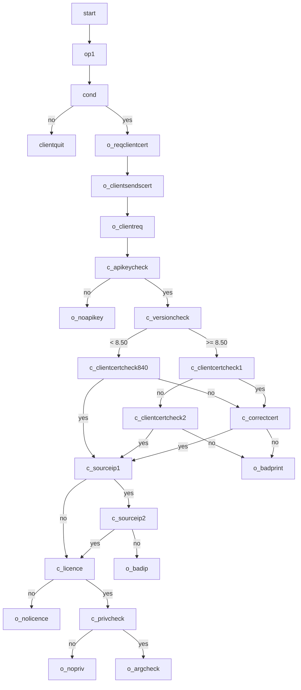

# Gallagher Command Centre REST API

In 2020 this Github repository became the authoritative source of the reference documentation for
Command Centre's REST API.

The `ref` folder of this repository contains the documentation in HTML form.  You can browse it
online at [github.io].

We use [Spectacle](https://github.com/sourcey/spectacle) to generate that HTML from OpenAPI/Swagger
2.0 files in the `swagger` folder.  Generating good-looking HTML is the sole purpose of those
Swagger files:  we do not use them for code generation or API testing.  Therefore they do not follow
OpenAPI guidelines where doing so would compromise the readability of the documentation.

To download the HTML and YAML in a zip file use the Code button on
[Github.com](https://github.com/GallagherSecurity/cc-rest-docs).  However, to benefit from our
regular improvements to that documentation we suggest you browse [the HTML][github.io] whenever
possible.

[github.io]: https://gallaghersecurity.github.io/cc-rest-docs/ref

